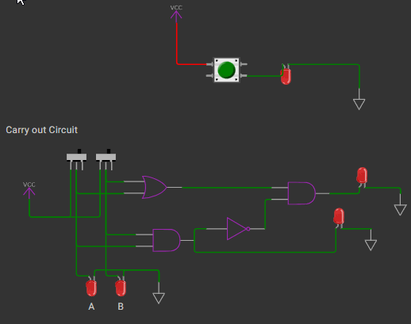
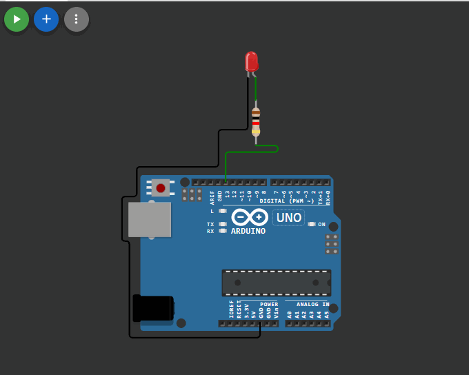
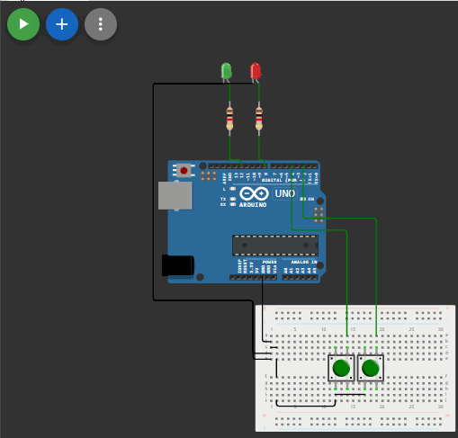
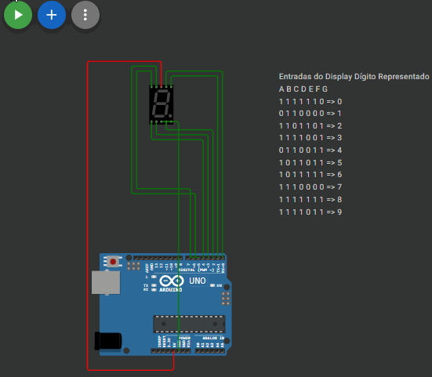

# NOTA AO LEITOR
Para tornar a documentação desta atividade mais acessível e intuitiva, utilizamos gifs ao invés de imagens. Consulte o [link](#https://github.com/jAzz-hub/Microcontroladores_CEFET-MG/blob/main/Atividade_2/relat%C3%B3rio.md) aqui em função de visualiza-los.

## Questão 1
**Circuito de Carry utilizando Switches**

- Experimento:
<!-- Q1 - Hello World Wokwki-->
<iframe width="600" height="400" src="https://wokwi.com/projects/429028773984946177" frameborder="0"></iframe>

-[Link do experimento](#https://wokwi.com/projects/429028773984946177)

- [Gifs do experimento](#Documentation/gifs/1.gif):    

## Questão 2 parte 1
**Hello World através do arduino(LED Aceso na porta 13)**

- Experimento:
<!-- Q2 - Parte 1 -->
<iframe width="600" height="400" src="https://wokwi.com/projects/429719586259513345" frameborder="0"></iframe>

-[Link do experimento](#https://wokwi.com/projects/429719586259513345)

- [Gifs do experimento](#Documentation/gifs/2.1.gif)    

## Questão 2 parte 2
**Acendendo LEDs de forma intercalada por botões**

- Experimento:
<!-- Q2 - Parte 2 -->
<iframe width="600" height="400" src="https://wokwi.com/projects/429710619276322817" frameborder="0"></iframe>

-[Link do experimento](#https://wokwi.com/projects/429710619276322817)

[Gifs do experimento](#Documentation/gifs/2.2.gif)

## Questão 3
**Ascendendo 9 no display de 7 segmentos**

- Experimento:
<!-- Q3 - -->
<iframe width="600" height="400" src="https://wokwi.com/projects/430296235882333185" frameborder="0"></iframe>

-[Link do experimento](#https://wokwi.com/projects/430296235882333185)

[Gifs do experimento](#Documentation/gifs/3.gif)

## Questão 4
**Ascendendo números de modo crescente pelo acionamento de switches**

- Experimento:
<!-- Q4 - -->
<iframe width="600" height="400" src="https://wokwi.com/projects/430956752300134401" frameborder="0"></iframe>

- [Link do experimento](#https://wokwi.com/projects/430956752300134401)

[Gifs do experimento](#Documentation/gifs/4.gif)    

